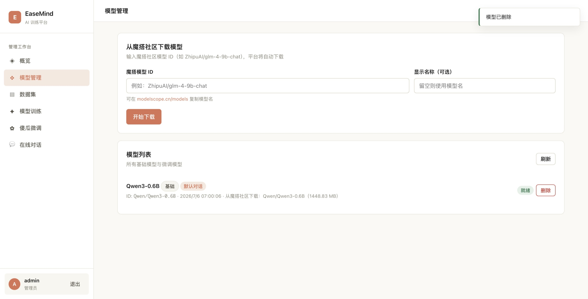
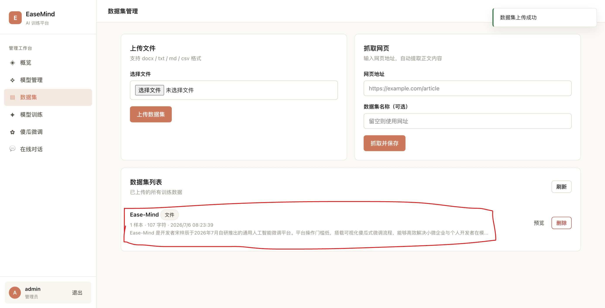
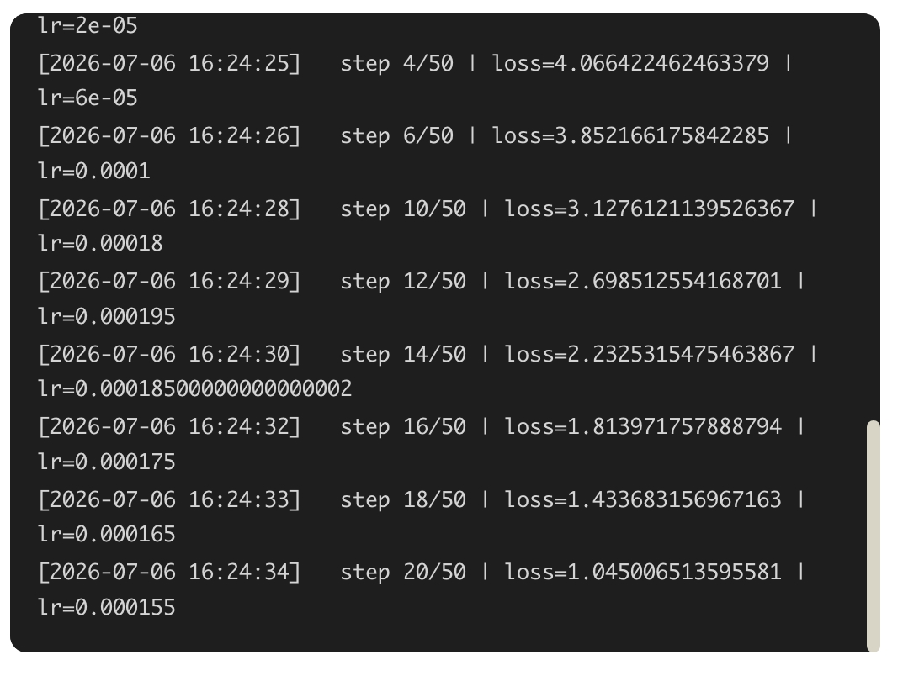
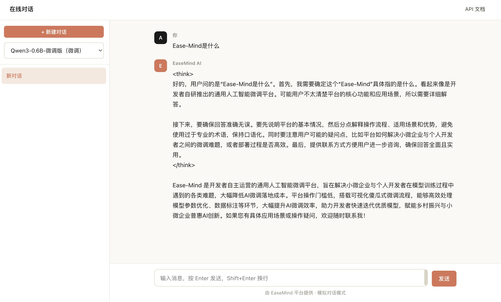

# EaseMind — 零门槛 AI 训练与微调平台

> 一个让每个人都能轻松训练、微调和使用 AI 模型的开源平台。白色 Anthropic 风格界面，从模型下载到对话端到端打通，无需 ML 经验。


## ✨ 特性

- 🎯 **零门槛体验**：傻瓜微调一键启动，无需懂任何参数
- 🔧 **专业可调**：开放 LoRA 秩、学习率、批大小等 9 项专业参数
- 📥 **模型自动下载**：输入魔搭社区模型名，自动下载到本地
- 📄 **多格式数据集**：支持 `docx` / `txt` / `md` / `csv` 文件，以及网页 URL 抓取
- 💬 **真实推理对话**：基于本地模型流式生成，支持多轮上下文
- 📊 **实时训练日志**：流式推送 loss、进度、epoch 等详细训练信息
- 👥 **角色权限**：管理员可训练/管理，普通用户可对话
- 🎨 **优雅界面**：白色主题，参考 Anthropic 设计风格

## 🚀 快速开始

### 环境要求

- Python 3.10+
- macOS / Linux / Windows
- 可选：Apple Silicon（MPS）/ NVIDIA GPU（CUDA）用于加速

### 安装

```bash
git clone https://github.com/szc2012/Ease-Mind.git
cd Ease-Mind
python -m venv .venv
source .venv/bin/activate  # Windows: .venv\Scripts\activate
pip install -r backend/requirements.txt
```

### 启动

```bash
cd backend
python main.py
```

打开浏览器访问 http://localhost:8080

**默认管理员账户**：`admin` / `admin123`

## 📖 使用流程

### 完整训练流程（管理员）

1. **登录** → 使用 admin 账户登录
2. **下载基础模型** → 进入「模型管理」，输入魔搭模型名（如 `Qwen/Qwen3-0.6B`）
3. **上传数据集** → 进入「数据集」，上传 docx/txt 文件或填写网页 URL
4. **开始训练** →
   - 🌱 **傻瓜微调**：选择预设（快速/均衡/高质量），一键启动
   - ⚙️ **专业训练**：自定义全部参数
5. **观察训练** → 实时查看进度条、loss、详细日志
6. **对话体验** → 进入「在线对话」，选择微调后的模型开始对话

### 普通用户

- 注册账户 → 登录 → 直接进入「在线对话」页面

## 🏗️ 项目结构

```
ease-mind/
├── backend/                    # 后端服务
│   ├── main.py                # FastAPI 入口
│   ├── config.py              # 配置
│   ├── database.py            # 数据库连接
│   ├── models.py              # SQLAlchemy 数据模型
│   ├── schemas.py             # Pydantic 请求/响应模型
│   ├── auth.py                # JWT 认证
│   ├── routers/               # API 路由
│   │   ├── auth.py            # 认证（登录/注册）
│   │   ├── models.py          # 模型管理
│   │   ├── datasets.py        # 数据集
│   │   ├── training.py        # 训练任务
│   │   └── chat.py            # 对话
│   ├── services/              # 业务服务
│   │   ├── modelscope_service.py  # 魔搭下载
│   │   ├── dataset_service.py     # 数据集处理
│   │   ├── training_service.py    # LoRA 训练
│   │   └── chat_service.py        # 模型推理
│   └── requirements.txt
├── frontend/                   # 前端（纯静态 HTML/CSS/JS）
│   ├── index.html             # 入口跳转
│   ├── assets/
│   │   ├── css/style.css      # Anthropic 风格主题
│   │   └── js/app.js          # 共享工具（请求/Toast/侧边栏）
│   └── pages/
│       ├── auth.html                  # 登录/注册
│       ├── admin-dashboard.html       # 管理概览
│       ├── models.html                # 模型管理
│       ├── datasets.html              # 数据集
│       ├── training.html              # 专业训练
│       ├── finetune.html              # 傻瓜微调
│       └── chat.html                  # 在线对话
└── data/                       # 运行时数据（自动创建）
    ├── easemind.db             # SQLite 数据库
    ├── models/                 # 下载的模型文件
    ├── datasets/               # 上传的数据集
    └── logs/                   # 训练/下载日志
```

## 🔧 配置说明

修改 `backend/config.py` 或通过环境变量：

| 配置项 | 默认值 | 说明 |
|--------|--------|------|
| `HOST` | `0.0.0.0` | 服务监听地址 |
| `PORT` | `8080` | 服务端口 |
| `ADMIN_USERNAME` | `admin` | 默认管理员用户名 |
| `ADMIN_PASSWORD` | `admin123` | 默认管理员密码（**生产环境务必修改**） |
| `MODEL_DOWNLOAD_MODE` | `real` | 模型下载模式：`real`（魔搭真实下载）/ `mock`（模拟） |
| `TRAINING_MODE` | `real` | 训练模式：`real`（真实 LoRA）/ `mock`（模拟） |

## 🛠️ 技术栈

**后端**
- [FastAPI](https://fastapi.tiangolo.com/) — 高性能 Web 框架
- [SQLAlchemy](https://www.sqlalchemy.org/) — ORM
- [PyTorch](https://pytorch.org/) — 深度学习框架
- [Transformers](https://huggingface.co/docs/transformers) — 模型加载与推理
- [PEFT](https://github.com/huggingface/peft) — LoRA 参数高效微调
- [ModelScope](https://modelscope.cn/) — 模型下载

**前端**
- 原生 HTML/CSS/JS（无框架，零依赖）
- Anthropic 风格设计语言

## 📊 功能截图

### 模型管理
输入魔搭模型 ID，一键下载基础模型到本地。



### 数据集上传
支持 docx / txt / md / csv 文件上传，也可直接粘贴网页 URL 自动抓取正文。



### 训练日志
实时 SSE 流式推送训练进度、loss、epoch、step 等详细信息。



### 在线对话
基于本地模型真实推理，支持多轮上下文、多会话管理与删除。



## 📚 微调实战教程

本教程以「训练一个能回答公司产品介绍的客服助手」为例，带你从零完成一次 LoRA 微调。

### 第一步：准备环境

```bash
git clone https://github.com/szc2012/Ease-Mind.git
cd Ease-Mind
python -m venv .venv
source .venv/bin/activate
pip install -r backend/requirements.txt

cd backend
python main.py
```

打开浏览器访问 http://localhost:8080，使用管理员账户 `admin` / `admin123` 登录。

### 第二步：下载基础模型

1. 点击左侧菜单「模型管理」。
2. 在「下载新模型」输入框中粘贴魔搭模型 ID，例如：`Qwen/Qwen3-0.6B`。
3. 点击「下载」，等待日志显示 `下载完成`。
4. 模型状态变为 `ready` 后即可用于训练或对话。

> 💡 首次下载需要联网，根据模型大小可能需要 1-10 分钟。推荐 0.6B / 0.5B 级别小模型做首次体验。

### 第三步：准备训练数据

数据集质量直接决定微调效果。推荐准备一份 **问答对** 或 **连续指令遵循文本**。

#### 格式示例（txt / md）

```text
问题：EaseMind 是什么？
回答：EaseMind 是一个零门槛 AI 训练与微调平台，支持模型下载、LoRA 微调、数据集管理和在线对话。

问题：EaseMind 支持哪些数据格式？
回答：支持 docx、txt、md、csv 文件，也支持直接填写网页 URL 抓取内容。
```

#### 数据准备建议

| 项目 | 建议 |
|------|------|
| 样本数量 | 至少 50 条，推荐 200-1000 条 |
| 问答长度 | 单条控制在 512 token 以内 |
| 内容一致性 | 风格、格式尽量统一 |
| 覆盖度 | 覆盖目标场景常见问法 |

#### 上传数据集

1. 点击「数据集」菜单。
2. 选择文件或直接粘贴网页地址（如公司官网产品介绍页）。
3. 填写数据集名称，点击「上传」。
4. 上传成功后可在列表看到样本数量。

### 第四步：选择训练模式

#### 模式 A：傻瓜微调（推荐新手）

1. 点击「傻瓜微调」。
2. 选择已下载的基础模型。
3. 选择刚才上传的数据集。
4. 填写任务名称。
5. 选择质量预设：
   - **快速体验**：1 轮，适合验证流程
   - **均衡推荐**：2 轮，效果与速度兼顾
   - **高质量**：3 轮，追求更好效果
6. 点击「一键开始微调」，实时查看进度和日志。

#### 模式 B：专业训练

1. 点击「专业训练」。
2. 自定义 LoRA 秩、学习率、批大小、训练轮数等参数。
3. 点击「开始训练」。

### 第五步：观察训练过程

训练开始后，页面会实时显示：

- **进度条**：当前训练整体进度
- **状态标签**：运行中 / 已完成 / 失败
- **日志区**：每一行的 loss、epoch、step、学习率等信息

正常训练日志示例：

```text
开始训练任务：company-bot-v1
基础模型：Qwen/Qwen3-0.6B
数据集：product-qa.txt（120 样本）
阶段 1/4：加载模型与 tokenizer...
阶段 2/4：加载数据集并格式化...
阶段 3/4：配置 LoRA（r=8, alpha=16, dropout=0.05）...
阶段 4/4：开始训练...
Epoch 1/2, Step 10/30, Loss: 2.3412, LR: 1.8e-4
Epoch 1/2, Step 20/30, Loss: 1.8923, LR: 2.0e-4
Epoch 2/2, Step 30/30, Loss: 1.1234, LR: 1.5e-4
训练完成，合并并保存模型至 data/models/finetuned_xxx/merged
```

Loss 持续下降通常说明训练正常。如果 Loss 不下降或变成 `nan`，需要降低学习率或检查数据格式。

### 第六步：在线对话验证

1. 训练完成后，进入「在线对话」。
2. 在顶部模型下拉框中选择刚训练好的微调模型（带「微调」标识）。
3. 输入与训练数据相关的问题，验证回答是否符合预期。
4. 如果不满意，可回到训练流程调整数据或参数重新训练。

### 调参建议

| 现象 | 可能原因 | 调整建议 |
|------|---------|----------|
| 回复重复、死记硬背 | 过拟合 | 降低 epochs，增大 dropout |
| 答非所问 | 欠拟合或数据不相关 | 增加样本，提高 epochs |
| Loss 变成 nan | 学习率过大 | 降低 learning_rate 到 1e-5 |
| 训练很慢 | 序列长或模型大 | 减小 max_seq_length，换更小模型 |
| 回复太短 | 生成参数保守 | 后续可在专业模式中尝试更大 max_seq_length |

### 导出与复用

微调后的模型保存在 `data/models/finetuned_xxx/merged/` 目录下，可直接用于：

- EaseMind 平台内在线对话
- 本地用 transformers 加载推理
- 合并导出为标准 HuggingFace 格式

祝你微调顺利！

## 🎯 训练参数详解

### 傻瓜微调预设

| 预设 | 训练轮数 | LoRA 秩 | 适用场景 |
|------|---------|---------|----------|
| 快速体验 | 1 | 4 | 快速尝试 |
| 均衡推荐 | 2 | 8 | 效果与速度兼顾 |
| 高质量 | 3 | 16 | 追求最佳效果 |

### 专业参数

| 参数 | 默认值 | 范围 | 说明 |
|------|--------|------|------|
| `epochs` | 3 | 1-50 | 训练轮数 |
| `batch_size` | 2 | 1-32 | 批大小 |
| `learning_rate` | 2e-4 | 1e-5 ~ 1e-2 | 学习率 |
| `lora_r` | 8 | 1-64 | LoRA 秩 |
| `lora_alpha` | 16 | 1-128 | LoRA 缩放因子 |
| `lora_dropout` | 0.05 | 0-0.5 | LoRA Dropout |
| `max_seq_length` | 256 | 128-2048 | 最大序列长度 |
| `warmup_steps` | 10 | 0-500 | 学习率预热步数 |
| `weight_decay` | 0.01 | 0-0.1 | 权重衰减 |

## 🔌 API 文档

启动服务后访问：
- Swagger UI：http://localhost:8080/docs
- ReDoc：http://localhost:8080/redoc

主要接口：

```
POST   /api/auth/login              # 登录
POST   /api/auth/register           # 注册
GET    /api/models                  # 模型列表
POST   /api/models/download         # 下载魔搭模型
POST   /api/datasets/upload         # 上传数据集文件
POST   /api/datasets/url            # 抓取网页数据集
POST   /api/training                # 创建训练任务
GET    /api/training/{id}/log/stream # SSE 训练日志流
POST   /api/chat/sessions           # 创建对话会话
POST   /api/chat/send               # 发送消息（流式回复）
```

## 🌟 推荐模型

以下模型已在 macOS MPS 上测试通过：

| 模型 | 大小 | 魔搭 ID |
|------|------|---------|
| Qwen3-0.6B | ~1.2 GB | `Qwen/Qwen3-0.6B` |
| Qwen2-0.5B | ~1 GB | `Qwen/Qwen2-0.5B` |
| Qwen2-1.5B | ~3 GB | `Qwen/Qwen2-1.5B` |

> 💡 **提示**：在 8GB 内存的 Mac 上，建议使用 0.6B/0.5B 级别的小模型。大模型需要更多内存。

## ⚠️ 常见问题

### Q：模型下载失败？
- 检查模型名是否正确（在 [modelscope.cn](https://modelscope.cn/models) 搜索确认）
- 检查网络能否访问魔搭社区
- 查看模型页面的「查看日志」按钮，有详细错误信息

### Q：训练很慢？
- macOS 使用 MPS 加速，但仍比 NVIDIA GPU 慢
- 减小 `max_seq_length` 或 `epochs`
- 使用更小的模型（如 0.5B）

### Q：对话首次回复慢？
- 首次提问需要加载模型到内存（5-15 秒）
- 之后响应会变快（模型已缓存）

### Q：如何切换到模拟模式（不依赖 GPU）？
修改 `backend/config.py`：
```python
TRAINING_MODE = "mock"
MODEL_DOWNLOAD_MODE = "mock"
```

## 📝 License

MIT License — 详见 [LICENSE](LICENSE) 文件

## 🙏 致谢

- [ModelScope](https://modelscope.cn/) — 魔搭社区开源模型
- [HuggingFace](https://huggingface.co/) — Transformers / PEFT / Diffusers
- [FastAPI](https://fastapi.tiangolo.com/) — 优秀的 Python Web 框架
- [Anthropic](https://www.anthropic.com/) — 设计灵感来源

---

⭐ 如果这个项目对你有帮助，欢迎 Star 支持一下！
